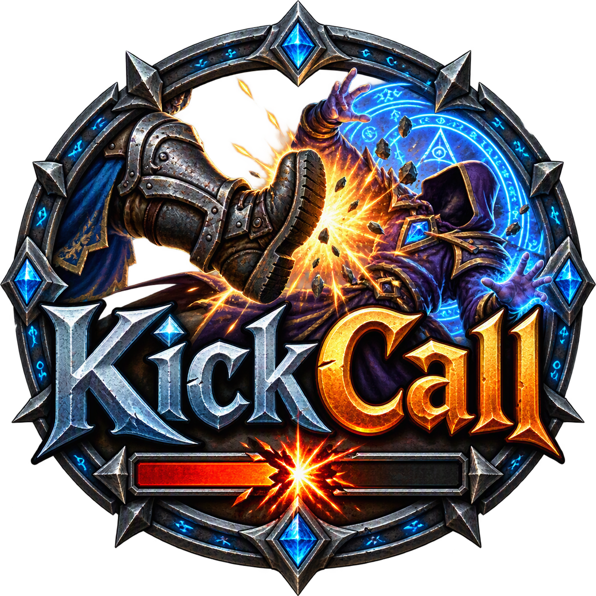

# KickCall

World of Warcraft addon (Retail 12.1, Midnight) for **all classes**. It plays a sound as soon as an enemy starts casting a spell, so you can interrupt in time. Optionally a second sound follows when your interrupt was successful.

Sound only, nothing is shown on the screen.

> **The sound plays for every enemy spell cast.** Since Midnight the game does not tell addons whether a spell can be interrupted, so KickCall cannot filter by that.

## Features

- **Cast sound** when an enemy you have targeted or focused starts casting or channeling (optionally also every enemy with a visible nameplate)
- **Success sound** when your own interrupt stopped an enemy cast (optionally also when someone else interrupts)
- **Bundled voice alerts** in English and German; the default follows your client language. If a voice file is missing, the defaults are the WoW sounds *Raid Warning* (cast) and *Ready Check* (success).
- **Your own sounds:** up to five files in a separate folder that survives addon updates
- **LibSharedMedia:** every sound registered by other addons can be used, and KickCall's voice alerts are registered there for other addons
- **WoW sounds:** a few built-in game sounds such as Raid Warning or Ready Check
- **Sound channel:** Master (default), SFX, Dialog, Music or Ambience
- **Minimum gap** between two cast sounds (0.2 to 2.0 seconds, default 0.5)
- **Only in combat** and **only in instances** (both off by default)
- **Chat messages** on login and when testing are optional (off by default)
- **Languages:** English and German

Blizzard's own *Audio Assist* also announces interruptible casts, as text-to-speech and, according to players, only for your target. KickCall is an alternative with your own sounds, for focus and nameplates too.

## Installation

Download the zip from the [Releases](../../releases) page and extract it to `World of Warcraft\_retail_\Interface\AddOns\`. A CurseForge page follows.

The zip contains all required libraries. A plain copy of the repository does **not** work, because the libraries are only added by the packager.

## Usage

### Settings

Type `/kickcall` or open *Settings > AddOns > KickCall*. Changes apply immediately.

- **At the top:** the note that the sound plays for every enemy cast, and the interrupt KickCall found on your character.
- **Enemy starts casting:** on/off, sound, *Test* button.
- **Units:** target (on), focus (on), nameplates (off).
- **Interrupt successful:** on/off, sound, *Test* button, *Also when others interrupt* (off).
- **General:** sound channel, minimum gap, only in combat, only in instances, chat messages, *Test both* button.
- **Custom sounds:** where to put your own files (see below).
- **Debug:** debug mode and *Clear log*.

Settings are shared by all characters of your account.

The sound list contains, in this order: the bundled KickCall voice alerts (only if present), your own sounds, WoW sounds and all sounds registered with LibSharedMedia by other addons. If a chosen sound is no longer available (for example because the addon that provided it was removed), it is shown as *(missing)* and the default sound is played instead; your choice is kept. If a sound file cannot be played, KickCall tells you once in the chat and plays the WoW sound instead.

### Commands

| Command | Effect |
|---|---|
| `/kickcall` or `/kc` | Open the settings |
| `/kickcall help` | List the commands |
| `/kickcall test [cast\|success]` | Play both sounds one after the other (or only one) |
| `/kickcall status` | Show your interrupt and the current settings |
| `/kickcall debug on\|off\|clear\|status` | Debug log (`KickCallDebugLog` in SavedVariables, off by default) |

### Your own sounds

1. Create the folder `World of Warcraft\_retail_\Interface\AddOns\KickCall_Sounds\`.
2. Put your files there as `sound1.ogg` to `sound5.ogg` (the names are fixed).
3. **Restart WoW completely.** `/reload` does not detect new files.
4. Choose them in the settings (*Custom: sound1.ogg* …).

The folder is separate from the `KickCall` folder, so updates do not touch your files.

## How it works

The detection was worked out in game with a test addon (`docs/reference/InterruptTest.lua`).

**Cast sound:** KickCall listens to `UNIT_SPELLCAST_START`, `UNIT_SPELLCAST_CHANNEL_START` and `UNIT_SPELLCAST_EMPOWER_START` for `target`, `focus` and the nameplates. The unit must be attackable (`UnitCanAttack`). Spell ID, spell name and whether the spell can be interrupted are hidden from addons in combat, so they are not used. The same cast is reported for your target and its nameplate at the same moment; after a sound, further casts are ignored for the minimum gap.

**Success sound:** when you cast your interrupt (`UNIT_SPELLCAST_SUCCEEDED` for yourself with a known interrupt spell ID) and an enemy's cast is interrupted (`UNIT_SPELLCAST_INTERRUPTED`) within 1 second, the success sound plays. The success sound has its own 0.5-second block.

**Interrupt spells:** KickCall checks on login and on specialization or spell changes which of these spells your character knows:

| Class | Spell | ID |
|---|---|---|
| Death Knight | Mind Freeze | 47528 |
| Demon Hunter | Disrupt | 183752 |
| Druid | Skull Bash / Solar Beam | 106839 / 78675 |
| Evoker | Quell | 351338 |
| Hunter | Counter Shot / Muzzle | 147362 / 187707 |
| Mage | Counterspell | 2139 |
| Monk | Spear Hand Strike | 116705 |
| Paladin | Rebuke | 96231 |
| Priest | Silence | 15487 |
| Rogue | Kick | 1766 |
| Shaman | Wind Shear | 57994 |
| Warlock | Spell Lock / Axe Toss | 19647, 119910 / 119914 |
| Warrior | Pummel | 6552 |

Only Rebuke (Paladin) has been confirmed in game so far.

## Development

Libraries are fetched by the [BigWigs packager](https://github.com/BigWigsMods/packager) from `.pkgmeta` and are not part of the repository: LibStub, CallbackHandler-1.0, AceDB-3.0, AceGUI-3.0, AceConfig-3.0, LibSharedMedia-3.0.

### Releases

Pushing a tag `v*` (for example `v1.0.0`, test builds `v1.0.0-alpha.N` or `v1.0.0-beta.N`) starts `.github/workflows/release.yml`. It builds a zip with all libraries, the icon and the bundled sounds, and publishes it as a GitHub release.

**CurseForge upload:** the packager uploads to CurseForge when both a token and a project ID are present:

- the project ID goes into `KickCall.toc`: remove the leading `# ` from the prepared line `# ## X-Curse-Project-ID:` and enter the ID,
- the API token is stored as the Actions secret **`CF_API_TOKEN`** (*Settings > Secrets and variables > Actions*) and passed to the packager by the workflow. A new token can be created at <https://authors.curseforge.com/#/settings/api-tokens>.

## License

MIT, see [LICENSE](LICENSE).
